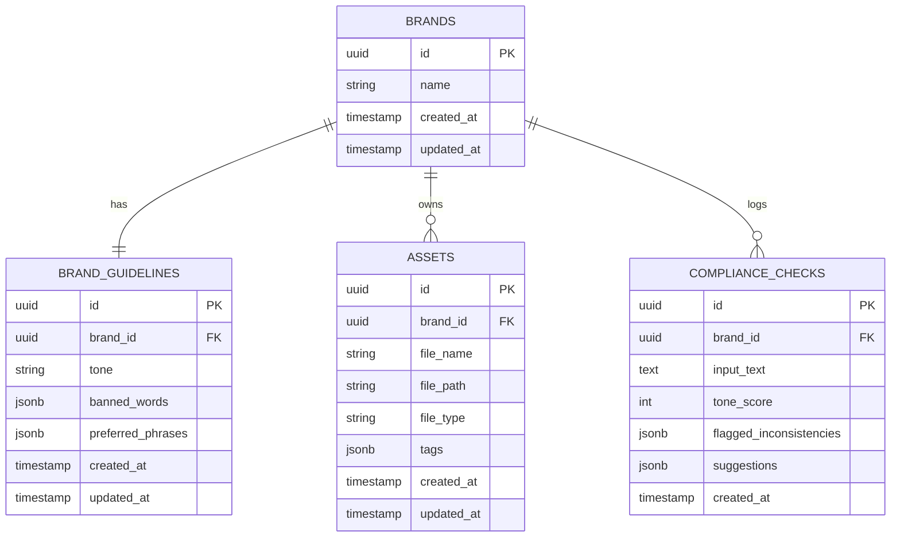

# AI Brand Consistency & Asset Manager

> Mindset shifting into: full-stack product engineers who think in systems, design with intention, and ship production-ready software with the help of AI.

**Architecture Style:** Client-Server / Monolithic API with SPA frontend  
**Deployment:** Containerized via Docker

---

## Problem Statement

PR teams and brand managers struggle to ensure that all published content aligns with brand guidelines (tone, vocabulary, identity). Manual review is slow, subjective, and inconsistent.

## Solution

A lightweight platform that:

- Centralizes brand assets and guidelines
- Uses an LLM (Gemini API) to evaluate content
- Produces objective compliance scores + actionable suggestions

---

## Prerequisites & Setup

### Prerequisites

| Requirement | Version | Notes |
|---|---|---|
| [Docker](https://docs.docker.com/get-docker/) + Compose V2 | Latest | `docker compose` (not `docker-compose`) |
| [Gemini API Key](https://aistudio.google.com/app/apikey) | Free tier | Required for compliance checks |
| Node.js *(local dev only)* | 22+ | Only needed if running without Docker |
| PostgreSQL *(local dev only)* | 15+ | Only needed if running without Docker |

---

### 1. Environment Configuration

Copy the root-level example file and fill in the required values:

```bash
cp .env.example .env
```

Open `.env` and set the two required variables:

```dotenv
# Required — generate a free key at https://aistudio.google.com/app/apikey
GEMINI_API_KEY=your_gemini_api_key_here

# Required for production; the default below is safe for local development only
APP_KEY=zKXHe-Ahdb7aPK1ylAJlRgTefktEaACi
```

All other variables have working defaults for local development (Postgres credentials, ports, etc.). See [.env.example](.env.example) for the full list.

---

### 2. Quick Start (Docker — Recommended)

Docker Compose builds all three containers, runs database migrations automatically, and starts every service in the correct order.

```bash
# 1. Configure environment (see step above)
cp .env.example .env
# edit .env and set GEMINI_API_KEY

# 2. Build images and start all services
docker compose up --build
```

On first run, Docker will:
1. Build the `backend` and `frontend` images from their Dockerfiles
2. Start the `database` container and wait for it to pass its health check
3. Run all pending database migrations (`node ace migration:run --force`)
4. Start the AdonisJS dev server (with HMR) and the Vite dev server

Once running, the app is available at:

| Service | URL |
|---|---|
| Frontend (Vue / Vite) | <http://localhost:5173> |
| Backend API (AdonisJS) | <http://localhost:3333> |
| PostgreSQL | `localhost:5432` |

**Stopping the stack:**

```bash
# Stop containers (data volumes are preserved)
docker compose down

# Stop containers AND delete all data volumes (full reset)
docker compose down -v
```

---

### 3. Local Development (Without Docker)

Use this path when you need direct IDE debugging or want to run services individually.

#### 3a. Database

Start a local PostgreSQL 15 instance and create the database:

```sql
CREATE DATABASE brand_ai;
```

#### 3b. Backend

```bash
cd backend

# Install dependencies
npm install

# Copy and configure the backend-specific env file
cp .env.example .env
# edit .env — set DB_HOST=localhost and add your GEMINI_API_KEY

# Run database migrations
node ace migration:run

# Start the dev server (port 3333, with HMR)
npm run dev
```

#### 3c. Frontend

```bash
cd frontend

# Install dependencies
npm install

# Start the Vite dev server (port 5173)
npm run dev
```

---

### Troubleshooting

| Symptom | Likely Cause | Fix |
|---|---|---|
| Backend exits immediately on startup | `database` container not ready | Let the health check finish; retry `docker compose up` |
| Compliance checks return a neutral score | `GEMINI_API_KEY` missing or invalid | Verify the key in `.env` and restart the backend |
| Port already in use | Another process on 3333 or 5173 | Stop the conflicting process or change the port in `.env` and `docker-compose.yml` |
| Migration errors on first run | Stale volume from an old schema | Run `docker compose down -v` to clear volumes, then `docker compose up --build` |

---

## Architecture

### 1. Frontend Layer (Vue.js)

- **Framework:** Vue 3 (Composition API)
- **State Management:** Pinia — manages the active brand context and holds dashboard compliance score trends
- **Routing:** Vue Router — views: Dashboard, Brand Settings/Guidelines, Asset Library, Compliance Tester
- **UI/UX:** Drag-and-drop for asset uploads; split-pane view for the Compliance Checker (input text on the left, AI feedback on the right)

### 2. Backend Layer (AdonisJS)

- **Framework:** AdonisJS (REST API mode)
- **Database Access:** Lucid ORM — handles upsert logic for the 1:1 Brand Guidelines relationship and relational queries for the dashboard
- **Controllers:**
  - `BrandsController` — Full CRUD
  - `GuidelinesController` — Upsert: `updateOrCreate`
  - `AssetsController` — CRUD + local file system handling
  - `ComplianceChecksController` — Store & Index only
- **AI Service Integration:** A dedicated `GeminiService` class handles all Gemini Free Tier API calls, keeping prompt engineering and rate-limit handling isolated from controllers

### 3. Database Layer (PostgreSQL)

- Relational structure optimized for fast reads on the dashboard
- Heavy use of `JSONB` columns for flexible arrays (tags, banned words, AI suggestions) without needing pivot tables for everything

### 4. Infrastructure (Docker)

- Three containers: `frontend` (Node/Vite dev server), `backend` (Node/Adonis), and `database` (Postgres)
- **Storage:** A named Docker volume attached to the backend container (`/app/tmp/uploads`) persists locally stored brand assets between container restarts

---

## Infrastructure Design

The focus is on rapid iteration, Hot Module Replacement (HMR), and mirroring the architectural separation of services.

| Component | Technology | Responsibility |
|---|---|---|
| Frontend Container | Node.js | Runs the Vite development server on port `5173`. Uses bind mounts to watch local file changes and trigger instant UI updates. |
| Backend Container | Node.js | Runs the AdonisJS development server on port `3333`. Handles business logic, API routing, and communicates with the external Gemini API. |
| Database Container | PostgreSQL 15 | Runs locally on port `5432`. Stores all relational data, JSONB configurations, and compliance logs. |

### Network & Port Mapping

Container ports are mapped directly to the host machine for easy access during development.

- **Frontend:** `http://localhost:5173`
- **Backend API:** `http://localhost:3333`
- **Internal Routing:** The frontend container communicates with the backend via `VITE_API_URL=http://localhost:3333`. The backend communicates with the database using Docker's internal DNS (e.g., `DB_HOST=database`).

### Storage & Code Synchronization

Development uses a mix of persistent volumes (data survives container restarts) and bind mounts (code edits reflect instantly).

- **Bind Mounts (Code):** `./frontend` and `./backend` directories are directly mapped into their respective containers — changes reflect immediately on save.
- **Named Volumes (Data):**
  - `pgdata_volume` — Ensures database tables and records survive `docker-compose down`
  - `brand_assets_volume` — Ensures uploaded test files are not wiped when the backend container restarts

### Infrastructure Diagram


---

## Entity Relationship Diagram


