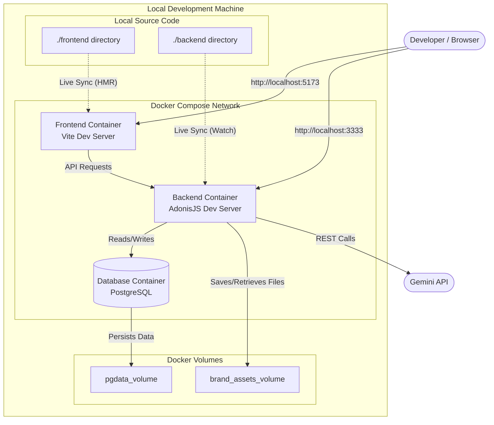
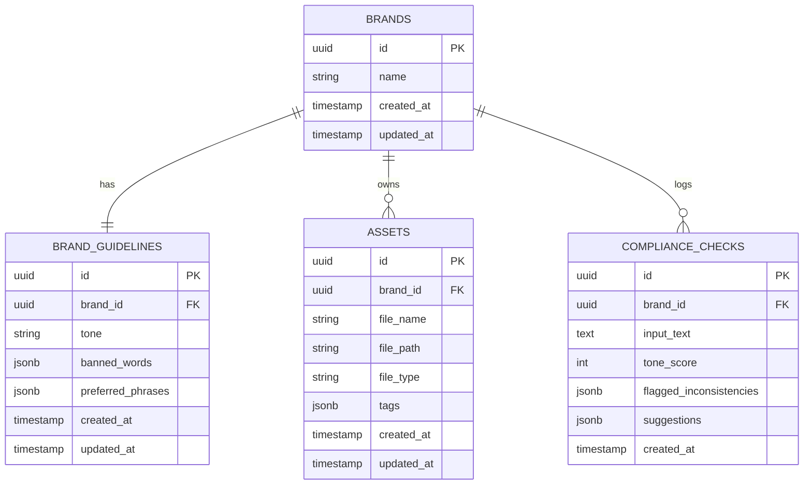

# AI Brand Consistency & Asset Manager

> Mindset shifting into: full-stack product engineers who think in systems, design with intention, and ship production-ready software with the help of AI.

**Architecture Style:** Client-Server / Monolithic API with SPA frontend  
**Deployment:** Containerized via Docker

---

## Problem Statement

PR teams and brand managers struggle to ensure that all published content aligns with brand guidelines (tone, vocabulary, identity). Manual review is slow, subjective, and inconsistent.

## Solution

A lightweight platform that:

- Centralizes brand assets and guidelines
- Uses an LLM (Gemini API) to evaluate content
- Produces objective compliance scores + actionable suggestions

---

## Architecture

### 1. Frontend Layer (Vue.js)

- **Framework:** Vue 3 (Composition API)
- **State Management:** Pinia — manages the active brand context and holds dashboard compliance score trends
- **Routing:** Vue Router — views: Dashboard, Brand Settings/Guidelines, Asset Library, Compliance Tester
- **UI/UX:** Drag-and-drop for asset uploads; split-pane view for the Compliance Checker (input text on the left, AI feedback on the right)

### 2. Backend Layer (AdonisJS)

- **Framework:** AdonisJS (REST API mode)
- **Database Access:** Lucid ORM — handles upsert logic for the 1:1 Brand Guidelines relationship and relational queries for the dashboard
- **Controllers:**
  - `BrandsController` — Full CRUD
  - `GuidelinesController` — Upsert: `updateOrCreate`
  - `AssetsController` — CRUD + local file system handling
  - `ComplianceChecksController` — Store & Index only
- **AI Service Integration:** A dedicated `GeminiService` class handles all Gemini Free Tier API calls, keeping prompt engineering and rate-limit handling isolated from controllers

### 3. Database Layer (PostgreSQL)

- Relational structure optimized for fast reads on the dashboard
- Heavy use of `JSONB` columns for flexible arrays (tags, banned words, AI suggestions) without needing pivot tables for everything

### 4. Infrastructure (Docker)

- Three containers: `frontend` (Node/Vite dev server), `backend` (Node/Adonis), and `database` (Postgres)
- **Storage:** A named Docker volume attached to the backend container (`/app/tmp/uploads`) persists locally stored brand assets between container restarts

---

## Infrastructure Design

The focus is on rapid iteration, Hot Module Replacement (HMR), and mirroring the architectural separation of services.

| Component | Technology | Responsibility |
|---|---|---|
| Frontend Container | Node.js | Runs the Vite development server on port `5173`. Uses bind mounts to watch local file changes and trigger instant UI updates. |
| Backend Container | Node.js | Runs the AdonisJS development server on port `3333`. Handles business logic, API routing, and communicates with the external Gemini API. |
| Database Container | PostgreSQL 15 | Runs locally on port `5432`. Stores all relational data, JSONB configurations, and compliance logs. |

### Network & Port Mapping

Container ports are mapped directly to the host machine for easy access during development.

- **Frontend:** `http://localhost:5173`
- **Backend API:** `http://localhost:3333`
- **Internal Routing:** The frontend container communicates with the backend via `VITE_API_URL=http://localhost:3333`. The backend communicates with the database using Docker's internal DNS (e.g., `DB_HOST=database`).

### Storage & Code Synchronization

Development uses a mix of persistent volumes (data survives container restarts) and bind mounts (code edits reflect instantly).

- **Bind Mounts (Code):** `./frontend` and `./backend` directories are directly mapped into their respective containers — changes reflect immediately on save.
- **Named Volumes (Data):**
  - `pgdata_volume` — Ensures database tables and records survive `docker-compose down`
  - `brand_assets_volume` — Ensures uploaded test files are not wiped when the backend container restarts

### Infrastructure Diagram

---

## Entity Relationship Diagram

